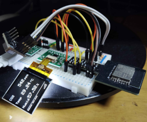

# Environment logger wireless

気温、湿度、気圧を測定し、HTTP経由で[サーバー](https://github.com/acaValkyrie/graph-dashboard)に送信する。
最新のデータをディスプレイに表示する。

Measures temperature, humidity and atmospheric pressure.
Sends data via wifi with http protocol to a [server](https://github.com/acaValkyrie/graph-dashboard).
Displays latest data on display.